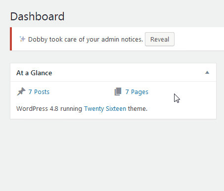

# Dobby

[](https://packagist.org/packages/tfrommen/dobby)
[](https://github.com/tfrommen/Dobby)
[](https://packagist.org/packages/tfrommen/dobby)
[](https://packagist.org/packages/tfrommen/dobby)

> Dobby, the friendly Admin Elf, takes care of all your (unwanted) admin notices.

## Installation

Install with [Composer](https://getcomposer.org):

```sh
$ composer require tfrommen/dobby
```

Or:

1. [Download ZIP](https://github.com/tfrommen/Dobby/releases).
1. Upload contents to the `/wp-content/plugins/` directory on your web server.
1. Activate the plugin through the _Plugins_ menu in WordPress.
1. See only a single admin notice, if at all.

### Requirements

This plugin **requires PHP 5.4** or higher, but you really **should be using PHP 7** or higher, as we all know.

## Usage

Dobby captures everything that gets printed on one of the admin notice hooks (i.e., `network_admin_notices`, `user_admin_notices`, `admin_notices` and `all_admin_notices`), and hides it, for now.
In case Dobby did capture anything, he will inform you (yes, via an admin notice).



## License

Copyright (c) 2017 Thorsten Frommen

This code is licensed under the [MIT License](LICENSE).
